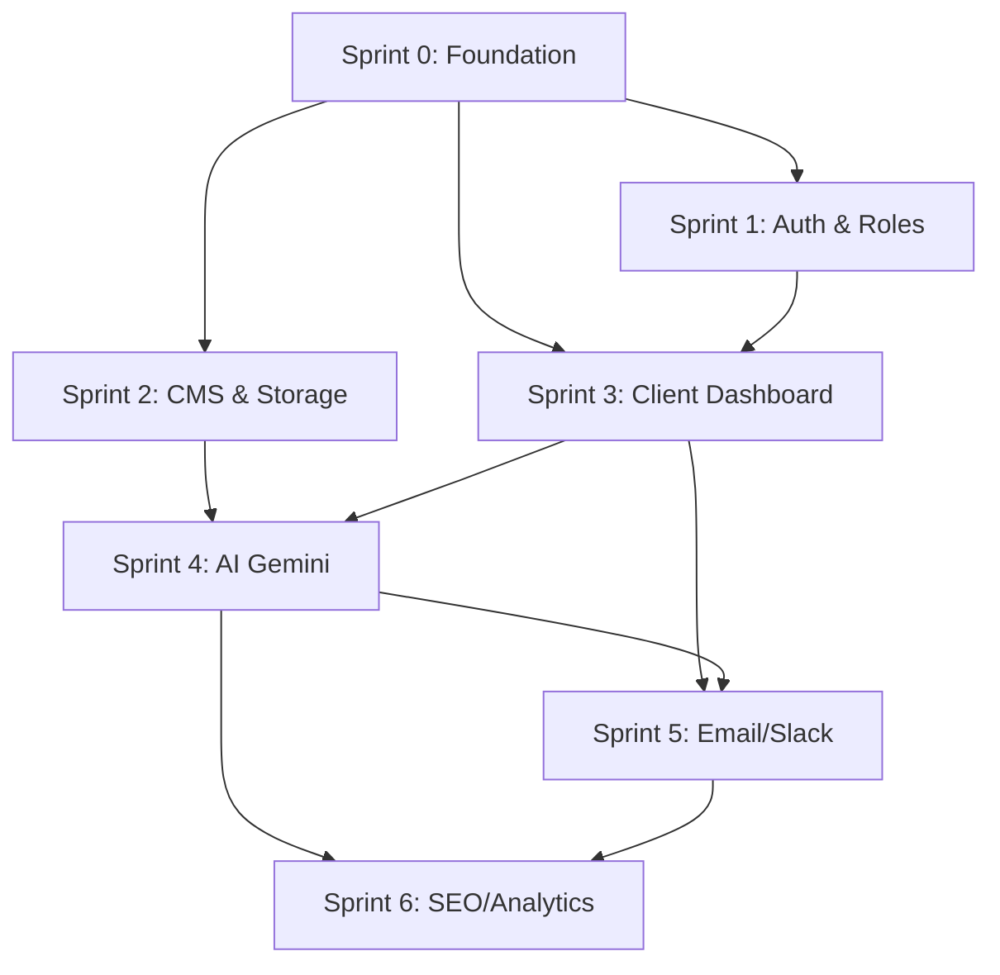

# BACKEND ROADMAP
**Data utworzenia:** 2026-03-17
**Wersja:** 1.0
**Autor:** AI Lead Backend Engineer

## 📊 EXECUTIVE SUMMARY
- **Liczba znalezionych atrap:** 18 (Critical: 5, Major: 8, Minor: 5)
- **Szacunkowy czas implementacji:** 6-8 tygodni
- **Główne ryzyka:**
    - Uzależnienie od limitów (quatas) Gemini API i Firebase Free Tier.
    - Złożoność reguł bezpieczeństwa Firestore dla wielodostępności (Multi-tenancy).
    - Integracja z Google Search Console API (wymaga OAuth2 i weryfikacji domeny).

## 📋 INVENTORY OF MOCKS (Szczegółowa lista)

### Critical Priority
| Plik | Linia | Kod (skrót) | Kategoria | Sprint | Opis |
|------|-------|-------------|-----------|--------|------|
| `src/services/googleSearchConsoleService.ts` | 16-41 | `setTimeout... return mockData` | Full Mock | 6 | Brak rzeczywistej integracji z Google API |
| `src/components/Contact.tsx` | 81 | `setTimeout(() => { ... })` | Fake Loading | 1 | Symulacja wysyłania formularza kontaktowego |
| `src/services/notificationService.ts` | 9 | `console.log("[SIMULATION]...")` | Simulation | 5 | Brak wysyłki do Slack/Discord |
| `src/components/AdminDashboard.tsx` | 2543 | `onClick={() => {}}` | Empty handler | 2 | Brak zapisu zmian w konfiguracji systemowej |
| `src/features/client-os/components/ClientDashboard.tsx` | 25 | `setTimeout(() => { ... })` | Fake Loading | 3 | Symulacja pobierania preferencji użytkownika |

### Major Priority
| Plik | Linia | Kod (skrót) | Kategoria | Sprint | Opis |
|------|-------|-------------|-----------|--------|------|
| `src/services/aiLeadService.ts` | 20 | `if (!process.env.GEMINI_API_KEY)` | Placeholder | 4 | Blokada funkcji AI przy braku klucza |
| `src/components/Header.tsx` | 153 | `onClick={() => {}}` | Empty handler | 1 | Nieaktywne akcje w menu nawigacyjnym |
| `src/components/Blog.tsx` | 306 | `onClick={() => {}}` | Empty handler | 2 | Brak obsługi lajków/udostępnień |
| `src/components/portal/ProjectProgress.tsx` | 59 | `onClick={() => {}}` | Empty handler | 3 | Brak interakcji z kamieniami milowymi |
| `src/features/client-os/components/MicroLearningCard.tsx` | 57 | `onClick={() => {}}` | Empty handler | 4 | Brak logiki "Oznacz jako przeczytane" |
| `src/components/AdminDashboard.tsx` | 1069 | `onClick={() => {}}` | Empty handler | 2 | Nieaktywne szybkie akcje na powiadomieniach |
| `src/components/AdminDashboard.tsx` | 1390 | `onClick={() => {}}` | Empty handler | 3 | Brak dodawania nowej aktywności do logu |
| `src/components/AdminDashboard.tsx` | 2111 | `onClick={() => { setSeoData(null); }}` | Partial logic | 6 | Reset zamiast rzeczywistej optymalizacji SEO |

### Minor Priority
| Plik | Linia | Kod (skrót) | Kategoria | Sprint | Opis |
|------|-------|-------------|-----------|--------|------|
| `src/components/LeadMagnet.tsx` | 176 | `src="https://picsum.photos/..."` | Mock image | 2 | Statyczna okłada e-booka |
| `src/components/AnalyticsProvider.tsx` | 42 | `console.log("[Analytics]...")` | Mock | 6 | Symulacja zewnętrznej analityki |
| `src/components/AdminDashboard.tsx` | 1303 | `{signups.length}` | Mock count | 3 | Licznik oparty na pobranych danych, nie na globalnym query |
| `src/components/Hero.tsx` | 65 | `font-bold text-gradient` | Static UI | 0 | Brak personalizacji tekstu przed AI (Hero personalizacja) |

## 🗺️ SPRINT ROADMAP

### Sprint 0: FOUNDATION (Konfiguracja & Bezpieczeństwo)
**Cel:** Przygotowanie infrastruktury bazowej.
- [ ] Konfiguracja `.env.local` dla wszystkich kluczy (Firebase, Gemini, Google).
- [ ] Utworzenie `firestore.rules` - zabezpieczenie kolekcji `private_logs`, `client_feedback`.
- [ ] Implementacja `ErrorBoundary` dla asynchronicznych usług.
- [ ] Standaryzacja `loading states` (Skeletons) w `ClientDashboard`.

### Sprint 1: AUTORYZACJA I PROFILE
**Cel:** Prawdziwe sesje i role.
- [ ] `ClientLogin.tsx`: Pełna obsługa `signInWithPopup` i weryfikacja czy użytkownik istnieje w `users`.
- [ ] `AdminDashboard.tsx`: Zabezpieczenie routingu przez middleware (Admin check).
- [ ] `hooks/useAuth.ts`: Rozbudowa o pobieranie roli z Firestore po `onAuthStateChanged`.

### Sprint 2: CMS ADMIN & STORAGE
**Cel:** Zarządzanie treścią (Blog, Portfolio, Testimonials).
- [ ] Integracja Firebase Storage dla obrazów w `BlogEditor` i `PortfolioManager`.
- [ ] Implementacja `handleSave` dla artykułów i projektów z walidacją danych.
- [ ] `handleDelete` z usuwaniem powiązanych plików z Storage.

### Sprint 3: CLIENT-OS & DASHBOARD
**Cel:** Real-time data dla klienta.
- [ ] `useClientOSStore.ts`: Zamiana `setTimeout` na `onSnapshot` z Firestore.
- [ ] `ProjectDetail.tsx`: Query filtrowane przez `auth.uid`.
- [ ] `Notifications`: Implementacja subkolekcji `unread` dla każdego klienta.

### Sprint 4: GEMINI AI CORE
**Cel:** Aktywacja inteligentnych funkcji.
- [ ] `aiLeadService.ts`: Konfiguracja `GoogleGenAI` z produkcyjnym kluczem.
- [ ] `handleGenerateTripleDoc`: Implementacja mechanizmu "Human in the Loop" (akceptacja przed publikacją).
- [ ] `ProjectNarration`: Automatyczny trigger przy zmianie statusu fazy w Firestore.

### Sprint 5: KOMUNIKACJA (WEBHOOKS)
**Cel:** Zewnętrzne powiadomienia i maile.
- [ ] `notificationService.ts`: Rzeczywiste query do Slack/Discord webhooks.
- [ ] Firebase Functions: `onNewLead` -> Wyślij email przez SendGrid.
- [ ] Firebase Functions: `onMessage` -> Powiadomienie Push do Admina.

### Sprint 6: OPTYMALIZACJA SEO & ANALITYKA
**Cel:** Pozyskiwanie danych i widoczność.
- [ ] `googleSearchConsoleService.ts`: Implementacja OAuth2 Flow do pobierania rzeczywistych danych.
- [ ] `AnalyticsProvider.tsx`: Integracja z GA4.
- [ ] Weryfikacja Sitemap i Metadata generatora opartego na AI.

## 🔗 DEPENDENCIES GRAPH

## ⚠️ RISK REGISTER

| Ryzyko | Prawdopodobieństwo | Wpływ | Mitigacja |
|--------|-------------------|-------|-----------|
| Przekroczenie limitów Gemini | High | Medium | Implementacja cache'owania wyników AI w Firestore |
| Wyciek danych klienta | Low | Critical | Rygorystyczne Firestore Rules (request.auth.uid) |
| Cold starts w Firebase Functions | Medium | Low | Wykorzystanie `minInstances` dla krytycznych funkcji |

## 📝 NOTES (Dodatkowe uwagi)
- Obecna struktura projektu (`src/features`, `src/services`) jest gotowa na przyjęcie logiki backendowej bez refaktoryzacji architektury.
- Zaleca się dodanie `Zod` do walidacji danych wejściowych przed zapisem do Firestore, aby uniknąć "dirty data".
- Należy rozważyć `React Query` (`useInfiniteQuery`) dla długich list logów w Dashboardzie Admina.
